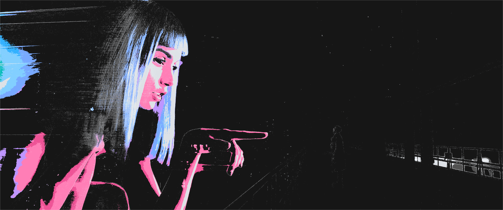

Examples (Bladerunner 2049 wallpaper)





Usage:

```
# Basic quantization
python base16_quantizer.py wallpaper.jpg theme.conf out.png

# Collapse dark pixels below brightness 40
python base16_quantizer.py wallpaper.jpg theme.conf out.png --threshold 40

# Highlight edges using $foreground (with optional edge threshold)
python base16_quantizer.py wallpaper.jpg theme.conf out.png --edges --edge-strength 25
```

- Omit --threshold to disable collapsing.
- Works with any Base16-compatible .conf file:

```conf
$color00=161616
$color01=262626
$color02=393939
$color03=525252
$color04=dde1e6
$color05=f2f4f8
$color06=ffffff
$color07=08bdba
$color08=3ddbd9
$color09=78a9ff
$color0A=ee5396
$color0B=33b1ff
$color0C=ff7eb6
$color0D=42be65
$color0E=be95ff
$color0F=82cfff
$foreground=f2f4f8
$background=161616
$cursor=ffffff
```

Credits:
- ChatGPT
